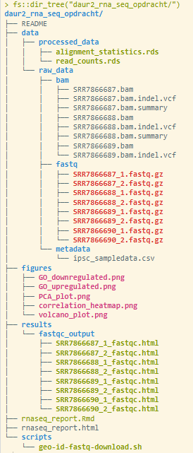
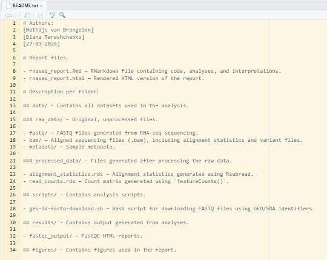

# Data management {-}

This assignment is intended to demonstrate that I am capable of managing data in data-heavy projects. As an example, the `daur2_rna_seq_opdracht` directory is used, which is part of the DAUR2 course. It is an RNA sequencing assignment that included many different components and required careful data management and documentation in a README file.

Below is the directory tree for the `daur2_rna_seq_opdracht` folder, generated using the `fs` package in R. 

```{r dir_tree, echo=FALSE, fig.cap='daur2_rna_seq_opdracht directory tree', out.width='80%', fig.align='left'}

```

```{r readme, echo=FALSE, out.width='80%', fig.align='left', fig.cap='daur2_rna_seq_opdracht README file'}

```

This portfolio is not a classic data analysis project. It was created using the bookdown package, which requires a specific folder structure, so the organization of the portfolio may appear somewhat chaotic. Due to the size of the portfolio, it is impossible to capture the entire structure in a screenshot, so below is the output of the fs::dir_tree("/home/diana.tereshchenko/dsfb2_workflows_portfolio/") command:
