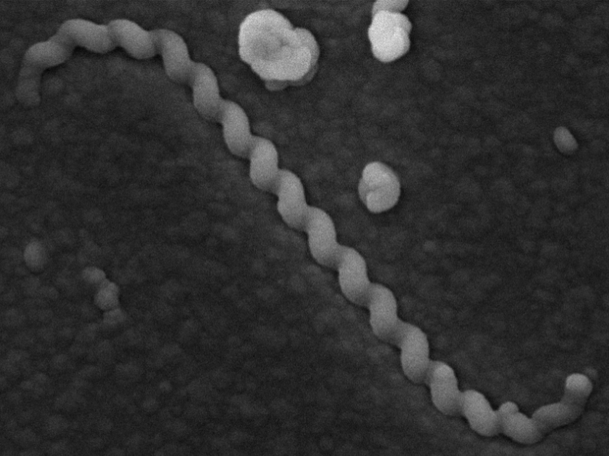

# Project Leptospira {-}

As this project is partially confidential, this section will focus on general information about *Leptospira*. The primary goal of this part of the portfolio is to demonstrate proper source citation skills.

Therefore, eight facts about *Leptospira* are presented below.

## Eight Facts About *Leptospira* {-}

1. Leptospires are thin, helical, and extremely mobile [@ko_2009].

```{r, echo=FALSE, out.width='80%', fig.align='left', fig.cap="Dr. Priscyla Ribeiro and Dr. Claudio Figueira"}

```
2. There are both pathogenic and non-pathogenic species. Human and animal infections are caused by only eight pathogenic species: L. interrogans, L. kirschneri, L. noguchi, L. santarosai, L. mayottensis, L. borgpetersenii, L. alexanderi, and L. weilli.

3. Pathogenic species are the etiological agents of leptospirosis [@ncbi_nbk441858].

4. The genus Leptospira is currently subdivided into 68 recognized genomic species [@garcia_lopez_2024].

5. The average genome size of Leptospira is approximately 4,128,000 ± 221,345 base pairs.

6. The average GC content of Leptospira ranges from 37.06% to 47.70% [@wilkinson_2021].

7. The estimated worldwide annual incidence of leptospirosis exceeds 1 million cases, including approximately 59,000 deaths [@cdc_leptospirosis].

8. Leptospira species are highly adaptable bacteria capable of surviving in both host organisms and environmental reservoirs such as water and soil.

# References {-}

<div id="refs"></div>
